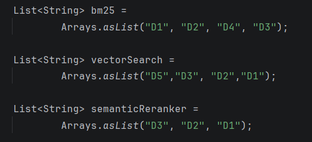
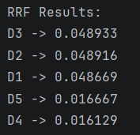

When building Retrieval Augmented Generation (RAG) systems, we may rely on multiple approaches / criteria to find the most relevant chunks of information from the knowledge bases. Different approaches can have different rankings for the perceived closeness of the chunk of information to the user query. Reciprocal rank fusion attempts to reconcile the ranked chunk information from each approach and arrives at a consolidated rank based on the rank of the chunk in each approach.

In its simplest form, reciprocal rank fusion helps to find a consolidated ranked list of items from multiple buckets. The items ranked higher in multiple buckets gets higher preference in the consolidated list and the vice versa.

# The Algorithm
## Terminologies
- Chunk - The element ranked across multiple buckets.
- Bucket - Each bucket contains the chunks ranked based on its own algorithms.
- Rank - The rank of the chunk in each bucket.
## The Algorithm - TLDR
Each chunk is assigned a score based on the rank it was assigned in each of the buckets. Lower ranked elements in a bucket would receive higher scores.The scores are added across multiple buckets and the consolidated list is sorted based on the consolidated score in descending order
## The Algorithm - In depth
- To calculate the score of a chunk in each bucket, we calculate the reciprocal (1/n) of the rank added with a smoothening constant **k** - called the hyperparameter.

```java
double rrf(int rank) {
    return 1 / (k + rank);
}
```

- For a moment, let's consider that we discard the smoothening factor by assinging k = 0, let' see the scores that would be assigned for each rank.
> k = 0


| Rank  | 1 | 2   | 3    | 4    |
|-------|---|-----|------|------|
| Score | 1 | 0.5 | 0.33 | 0.25 |

- It is easy to note that the 1st ranked chunk gets a score twice that of the second ranked element.
- This distorts the final results since a element ranked first in one of the bucket and ranked last in another bucket would be ranked higher than a chunk that is ranked second in two buckets.
- Let's consider the scores when the smoothening factor is chosen to be 100.
> k = 100

| Rank  | 1      | 2      | 20     | 40    |
|-------|--------|--------|--------|-------|
| Score | 0.0099 | 0.0098 | 0.0083 | 0.007 |

- We can see that the first ranked element has a score that is only 1% more than the second ranked result, yet it has a 20% higher score over the 20th ranked element.
- This primary intuition drives the effectiveness of this scoring function. Closer ranked elements are assigned closer scores and the first few ranks do not skew the scores too much.
# Implementation

```java
/**
     * Performs Reciprocal Rank Fusion (RRF) on multiple ranked lists.
     *
     * @param rankedLists List of ranked document lists
     * @param k           RRF constant (typically 60)
     * @return documents sorted by fused score
     */
    public static List<Map.Entry<String, Double>> fuse(
            List<List<String>> rankedLists,
            int k
    ) {

        Map<String, Double> scores = new HashMap<>();

        rankedLists.forEach(rankedList -> IntStream.range(0, rankedList.size())
                .forEach(rank ->
                        scores.merge(rankedList.get(rank), getRrfScore(k, rank), Double::sum)
                ));

        List<Map.Entry<String, Double>> result =
                new ArrayList<>(scores.entrySet());

        result.sort((a, b) ->
                Double.compare(b.getValue(), a.getValue()));

        return result;
    }

    private static double getRrfScore(int k, int rank) {
        return 1.0 / (k + rank);
    }
```
```
```

# Time Complexity
The time Complexity of reciprocal rank fusion algorithm is `O(D*F)`.
* D - The number of unique elements present across the buckets.
* F - The total number of buckets present.
# Test Runs
We can examine the effectiveness of the re-ranker by running it with some sample inputs.

* We can quickly observe that D1, D2 and D3 are the elements present across all the three buckets.
* D3 is ranked high in two of the buckets and has the lowest rank in the first bucket.
* D2 performs consistently well across the three buckets.
* D1's rank varies a lot - It has the top rank in one of the buckets but has the lowest rank in the other two.

From a layman's perspective, they would expect D1, D2 and D3 to be assigned the highest ranks since they are present across multiple buckets.

## Observations

* Elements with consistently higher ranks across buckets have been prioritized over the elements with varying ranks.
* D2 is ranked higher than D1 even when D2 has never been ranked first in any of the buckets, while D1 holds the first rank in one of the buckets - The k value of 60 minimizes the bias towards the first few ranks.

# Pros
* The biggest advantage of the reciprocal rank fusion algorithm is its lightweight nature. It is so easy to implement, quick and consumes very less resources.
* Unlike other machine learning based re-ranking algorithms (e.g. logistic regression), Reciprocal rank fusion requires no prior training and a easier learning curve.

# Cons
* Reciprocal rank fusion operates only based on the rank from each bucket. By ignoring the raw score from each bucket, we are discarding a crucial piece of information shared by the search method - How close does the bucket considers the element to be, when compared to the user's search query.
* The quality of the results highly depend on choosing the right value of k (the hyperparameter). This may need constant readjustment based on the underlying dataset.
# Considerations for Real Life Implementation
* Experiment and narrow down to the right hyperparameter k value.
* Introduce weighted buckets - Buckets contributing different scores based on their accuracy. 
  * The basic version of Reciprocal rank fusion considers all buckets to be equal.
  * When we are equipped with better knowledge about the better performance of few buckets, we can provide them higher weights to prioritize its rankings.
  * We can safely introduce newer buckets with low weights and slowly ramp-up their weights after observation in real production environments.
* Use this as the first stage ranker to filter down the resultset before passing on to a more expensive reranker (cross-encoder based) for higher precision.

# Conclusion
We have seen how and why reciprocal rank fusion is useful, fast and cheap. In the upcoming articles, we would explore how we can use reciprocal rank fusion to build robust RAG pipelines.

Stay tuned...
